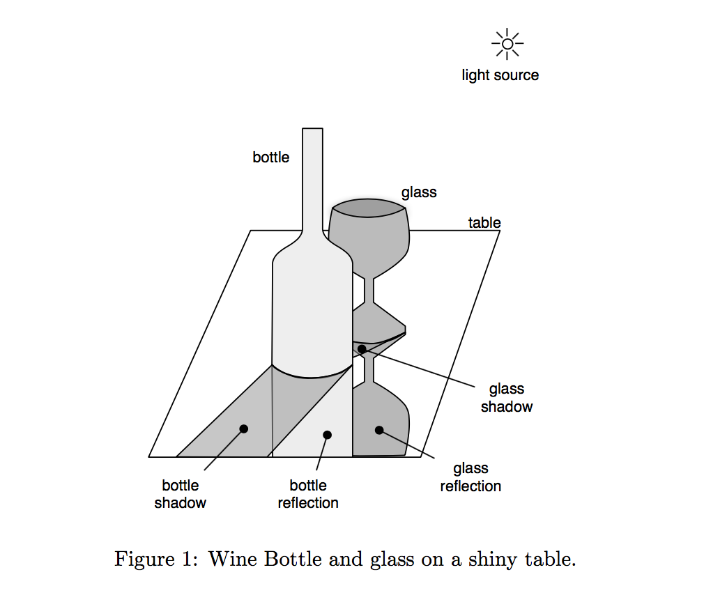

# Textures, Reflections, and Shadows
For this project, you will utilize WebGL’s stencil buffer and alpha blending facilities to render a scene that contains planar shadows 
and reflections. The surfaces should also be textured (procedurally or via 2D texture maps). The choice of objects is up to you – feel 
free to extend a previous project, The shadow and reflection “hacks” assume all reflections and shadows fall on a small set of planes 
(one in my example) as illustrated in Figure 1. A shadow and reflection algorithm that uses the stencil buffer and alpha blending is 
described in Section 2. Figure 3 shows several screen shots of my implementation. 

<center></center>

## To Build
To run simply extract folder Shadow&Reflection from archive. Open in favorite browser.
```
'.../Shadow&Reflection_Final/shadows&reflections.html' 
```

## Archive Contents
```
/Shadow&Reflection_Final            - root folder
    /matrix.js                      - Wayne O. Cochran matrix library
    /bottle.js                      - Holds model for bottle
    /glass.js                       - Holds model for glass
    /table.js                       - Holds model for table
    /marble.jpg                     - Used to texture table
    /wood.jpg                       - Used to texture glass
    /complete_wine_label.png        - Used to texture bottle
    /shadows&reflections.html       - Creates HTML canvas and renders scene in Canvas
    /README.md          
    /rsc                            - Holds README image resources
        /shadw&refct.png    
```

## Deployment
Tested on Safari and Chrome

## Built With
* WebGl
* JavaScript
* HTML/CSS

## Authors
* **Spencer Kitchen** - Dec 13 2016
email: sckitchen.dev@gmail.com

